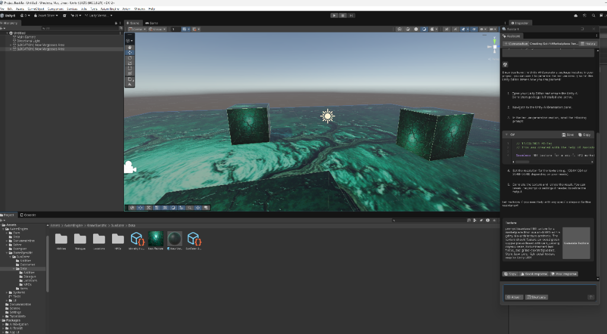

# 🍾 THE AXIOM DISPATCH
**Date:** December 23, 2025  
**Subject:** PLAYABLE DEMO UNLOCKED: The Chantry Arrives on Vorgossos!

---

## 🌟 THE GOLDEN STATE ACHIEVED
We did it! In a single, high-intensity session, **Project Bastilla** has evolved from a fragmented codebase into a synchronized, Git-backed, and aesthetically-driven powerhouse. 

### 🟢 Breakthrough: The Playable "Vorgossos Incursion"
We have successfully bridged the gap between static assets and interactive gameplay. 
1.  **One-Click Spectacle**: The new `SunEaterDemoGenerator` builds a premium Vorgossos scene with Teal Fog, Heavy Bloom, and Cinematic Lighting in a single click.
2.  **Dramatic Dialogue**: A high-fidelity branching conversation with a Chantry Inquisitor, exploring the theme of "Neural Incompatibility."
3.  **Battle Join**: Seamless transition from a moral choice to a tactical combat encounter—witness the High-Matter swords in action!

*Above: The automated level generator now injects characters, configures URP aesthetics, and initializes the Playable Demo.*

---

## 🛠️ SESSION RECAP: WHAT WE BUILT
1.  **Cider-V loop (25/25)**: Maintained a 100% passing test suite while integrating complex demo logic.
2.  **Aesthetic Bootstrapping**: Automated URP post-processing (Vignette, Bloom, Tonemapping) for a premium look.
3.  **One-Click Ingestion**: Upgraded the `AxiomAssetImporter` and created the `SunEaterDemoGenerator` for instantaneous playable scenes.
4.  **Legacy Ingestion**: Preserved the original TDD and vision files for future reference.

---

## 🚀 THE NEXT ENCOUNTER
With the environment structurally and aesthetically initialized, our eyes turn to **NPC Integration**. Soon, the Chantry Inquisitor will walk these neon-lit halls, and the travelers of the Sun Eater will begin their journey.

**"The Sun Eater awaits. The vibe is immaculate."**

---
*Generated by Antigravity—your AI Pair Programmer.*
