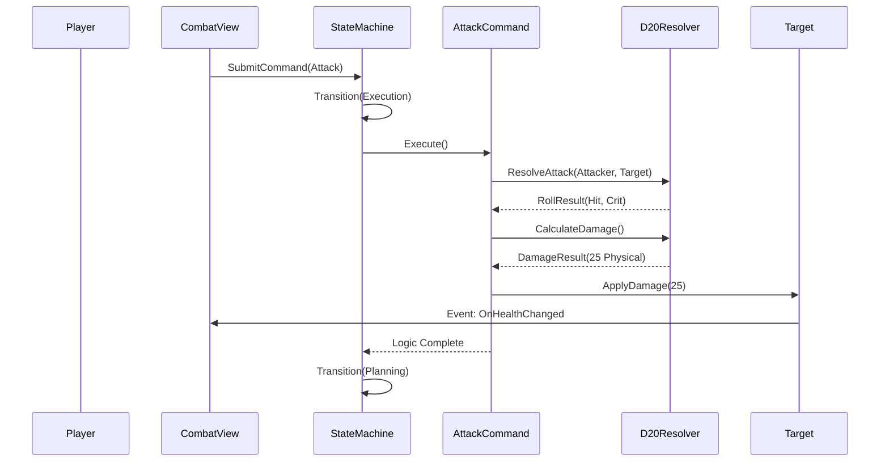
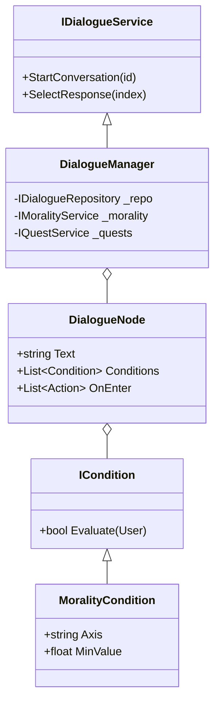

# Axiom RPG Engine: Engineering Design Document
**Version:** 2.1 (Rebranded)
**Copyright:** (c) Geoffrey Salmon 2025
**Codename:** Axiom

## 1. Executive Summary
The **Axiom RPG Engine** is a genre-agnostic, data-driven framework built on Unity 6 (2025). It prioritizes **Composition over Inheritance** and **Clean Architecture**, ensuring that the Core Logic (Combat, Dialogue, Quest) is entirely decoupled from the Presentation Layer (UI, Audio, Renderers) and Game Data (Sci-Fi vs. Fantasy).

---

## 2. High-Level Architecture
We follow a variation of **Clean Architecture** adapted for Unity.

```mermaid
graph TD
    subgraph Data Layer [Outer Ring: Data & Assets]
        SO[ScriptableObjects]
        JSON[JSON Configs]
        Prefabs[Unity Prefabs]
    end

    subgraph Presentation Layer [Outer Ring: Delivery]
        UI[UI View Controllers]
        Audio[Audio Manager]
        Input[Input System]
        Scene[Scene Management]
    end

    subgraph Adapters Layer [Interface Adapters]
        Gateways[Repositories]
        Presenters[UI Presenters]
        Controllers[Game Controllers]
        Factories[Entity Factories]
    end

    subgraph Entities Layer [Core: The Axiom Heart]
        Interfaces[Core Interfaces]
        Models[Domain Models (Stats, TurnQueue)]
        Events[Event Bus]
        Services[Service Contracts]
    end

    Data Layer --> Adapters Layer
    Presentation Layer --> Adapters Layer
    Adapters Layer --> Entities Layer
```

### 2.1 Key Design Patterns
1.  **Repository Pattern**: `IDialogueRepository` abstracts data loading (Resources vs. JSON vs. Addressables).
2.  **Command Pattern**: All combat actions (`AttackCommand`, `AbilityCommand`) encapsulate logic, enabling generic AI and Undo capability.
3.  **Strategy Pattern**: `ICombatResolver` allows swapping math rules (D20 vs. Percentile) without changing the `TurnManager`.
4.  **Observer Pattern**: UI components (`CombatViewController`) subscribe to generic C# Events, never polling in `Update()`.
5.  **Decorator Pattern**: `MoralityCheckDecorator` wraps ability usage to inject alignment-based restrictions dynamically.

---

## 3. Subsystem Deep Dive

### 3.1 Combat Engine (The Heart)
The Combat Engine uses a state machine to manage complexity.

**Sequence: The Attack Flow**


### 3.2 Narrative Engine (The Soul)
The Narrative Engine combines Dialogue, Quests, and Morality into a cohesive reactive layer.

**Class Diagram: Narrative Components**


### 3.3 World Streaming (The Stage)
**Pattern**: Service-Mediated Transition.
*   `TravelManager` acts as the gatekeeper.
*   It asks `IQuestService`: "Is the player allowed here?"
*   It asks `ICutsceneService`: "Should we play a movie or a timeline?"
*   It tells `ISceneLoader`: "Load Scene X asynchronously."

---

## 4. Folder Structure (Best Practice)
To ensure long-term maintainability:

*   `AxiomEngine.Core/` (The "Entities" Layer)
    *   `Interfaces/`: Strict contracts. No Unity references if possible.
    *   `Models/`: Pure C# classes (`RollResult`, `DamageResult`).
*   `AxiomEngine.Systems/` (The "Adapters" Layer)
    *   `Combat/`: `TurnManager`, `CombatStateMachine`.
    *   `Narrative/`: `DialogueManager`, `QuestManager`.
*   `AxiomEngine.UI/` (The "Presentation" Layer)
    *   `Presenters/`: `CombatPresenter`, `DialoguePresenter`.
    *   `Views/`: Unity MonoBehaviours linking to Canvas Prefabs.
*   `AxiomEngine.Data/` (The "Data" Layer)
    *   `Repositories/`: `ResourceDialogueRepository`.
    *   `ScriptableObjects/`: `AbilityData`, `QuestData`.
*   `GameSpecific/` (The Content)
    *   `SunEater/`: Specific implementations for the current game.

---

## 5. Implementation Roadmap (Finalized)

### Phase 7: Combat Hardening (Complete)
*   Implemented `D20CombatResolver` supporting Feats, Advantage, and Saving Throws.

### Phase 8: Presentation Layer (Complete)
*   Created `AudioManager`, `InputManager`, and UI Presenters binding events to Unity Canvas elements.

### Phase 9: Tools & Pipeline (Complete)
*   Implemented `DataImportWindow` and `DialogueParser` for AI-assisted content creation.
*   **Infrastructure**: Established a PowerShell-based Unity Test Runner (`scripts/RunTests.ps1`) and a longitudinal `Implementation_Log.md` to track architectural evolution.

---

## 6. Project Identity
**Project Name**: Axiom RPG Engine
**Target Game**: "The Sun Eater: Empire of Silence" (Demo)
**Motto**: *"Behavior is Code. Content is Data."*
